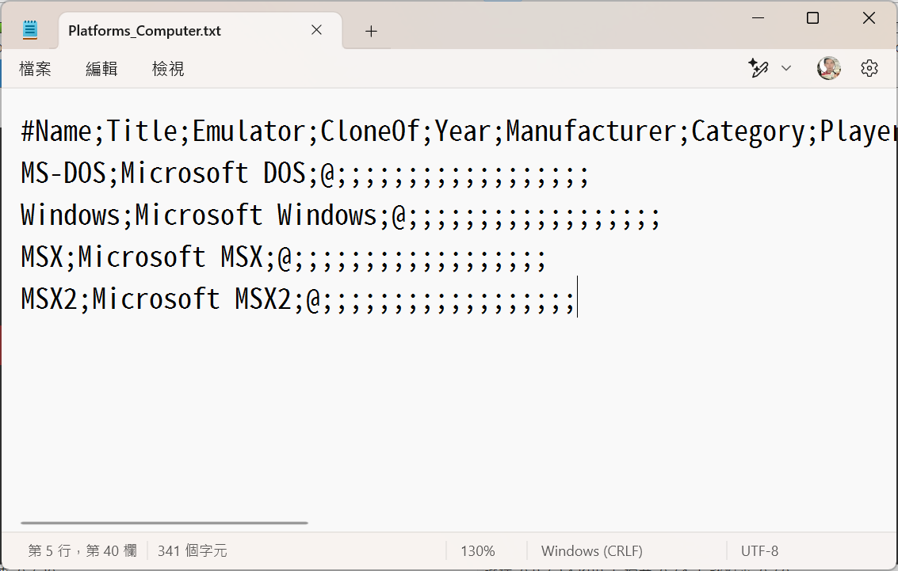
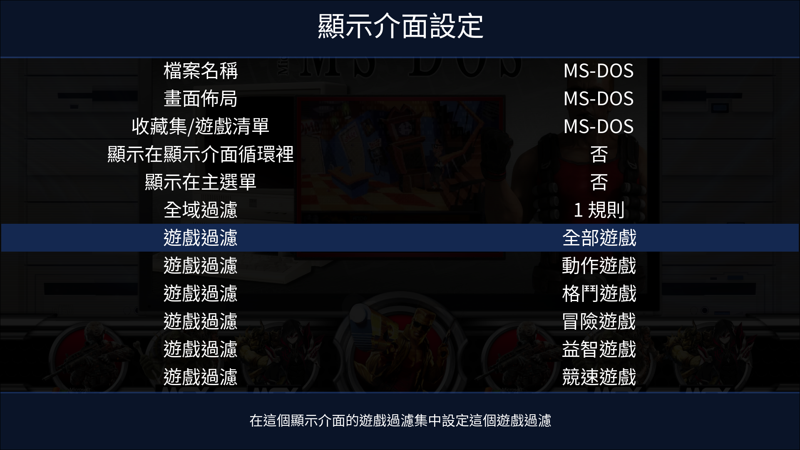

# Attract-Mode
# ${\color{red}ReturnToHomeFix}$
修正在第二層選單的 romlist 使用捷徑方式創建第三層選單後，從第三層選單返回主選單時，無法返回主選單正確位置的問題。

#

在 Attract-Mode 中並不提供直接使用三層選單的方式，例如:

- 主選單 (平台選擇, 例: 街機平台、家用機平台、掌機平台、電腦平台...等等)
   - 系統選單 (平台下的各系統選擇, 例: 任天堂、超級任天堂、SEGA Mega Drive、NEC PC Engine...等等)
     - 遊戲選單 (系統下的遊戲清單選擇)

不過 Attract-Mode 可以在第二層選單的 romlist 裡的 `Emulator` 欄位填入 `@`，這會直接讓你切換至以 `Name` 命名的顯示介面，例如下圖:

這個以 `Name` 命名的第三層顯示介面，須要將 `顯示在主選單` 關閉，才不會在主選單看到它。

此外掛主要就是修正使用這個方式所達成的三層選單，在第三層選單按下 `主選單熱鍵、 時不會正常返回主選單正確位置的問題。

#

# ${\color{red}KeyboardSearchDBCS}$
一個簡單的鍵盤輸入搜尋外掛，支援搜尋中文遊戲名稱 (Title & AltTitle)。

#

官方的 KeyboardSearch 外掛在搜尋中文遊戲名稱時會有問題，對於已經中文化遊戲名稱的用戶是個大問題。畢竟要在龐大的遊戲庫裡找到自己想要玩的遊戲，不是那麼容易的事情。雖然我沒有找到方法去美化這個搜尋介面，不過對於搜尋中文遊戲名稱的功能是可用的。

